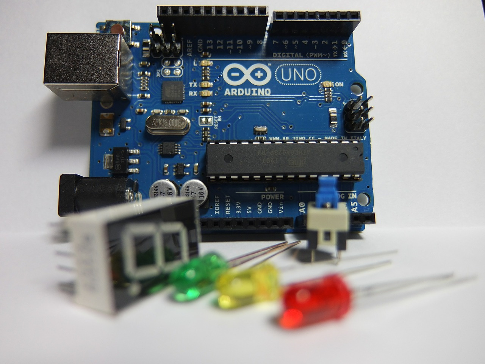
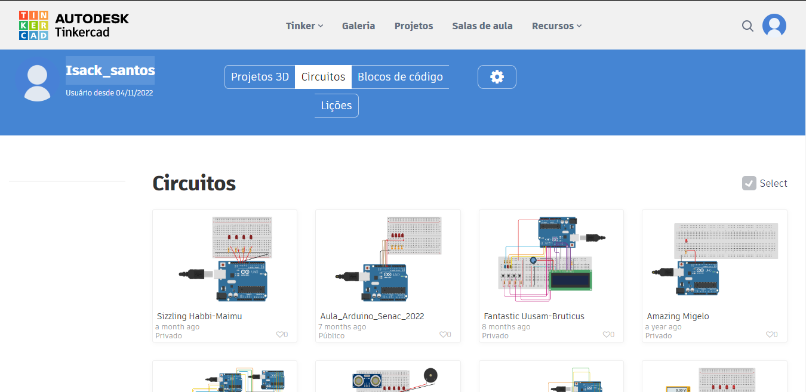

# Arduino

Nesse repositório teremos alguns códigos de projeto feito no Tinkercard e fisicamente que foi feito nas aulas do curso técnico de informática na instituição Senac
---
## O que é 
O Arduino é uma placa de prototipagem eletrônica que permite o desenvolvimento de projetos de automação residencial, como apagar as luzes automaticamente, regular a temperatura do ar-condicionado e muito mais. 

  

--- 
## Tinkercad

O Tinkercad é uma ferramenta online de design de modelos 3D em CAD e também de simulação de circuitos elétricos analógicos e digitais, desenvolvida pela Autodesk. Por ser gratuito e fácil de usar, encontramos nele uma oportunidade de ensino de Programação Embarcada, visto que a primeira barreira encontrada pelos alunos é a de não possuir os componentes e o microcontrolador em mãos.

  

---
## Meus projetos no Tinkercard:

  

